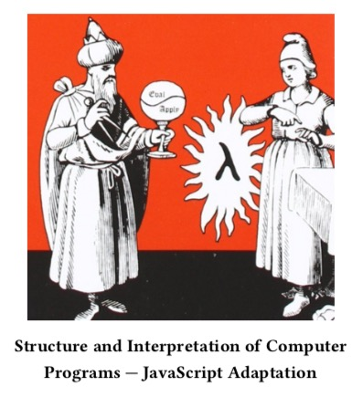

# List of Exercises in SICP

### Structured and Interpretation of Computer Programs

   

### Motivation on this

I read this books because I wanted to dig deeper in functional programming with the notion of JavaScript. Also to know more the basic of Computer Science concepts like recursion, linear iteration for optimizing compiler.

### About this book

You can get the copy of the book [here](ebook/sicpjs.pdf) if you want Thanks to the author who translated this books to JavaScript.

Thanks to Author of this book.